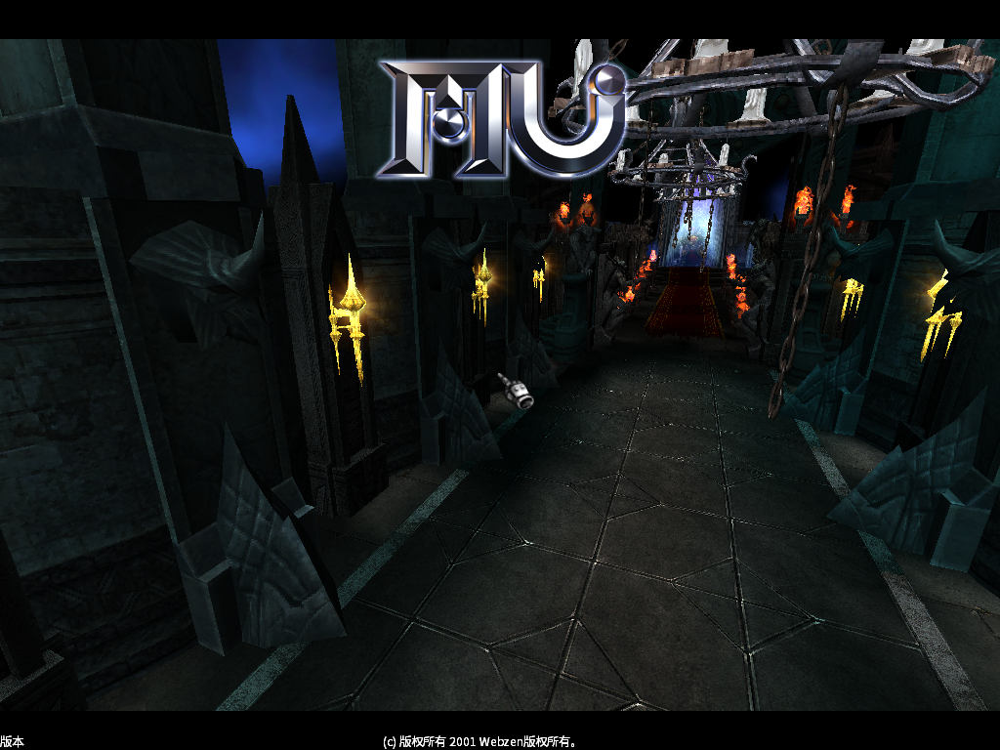
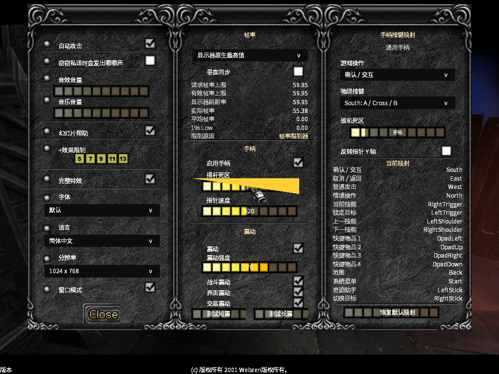
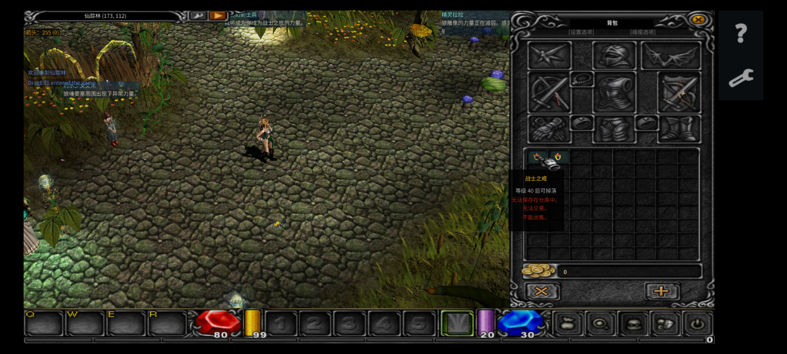
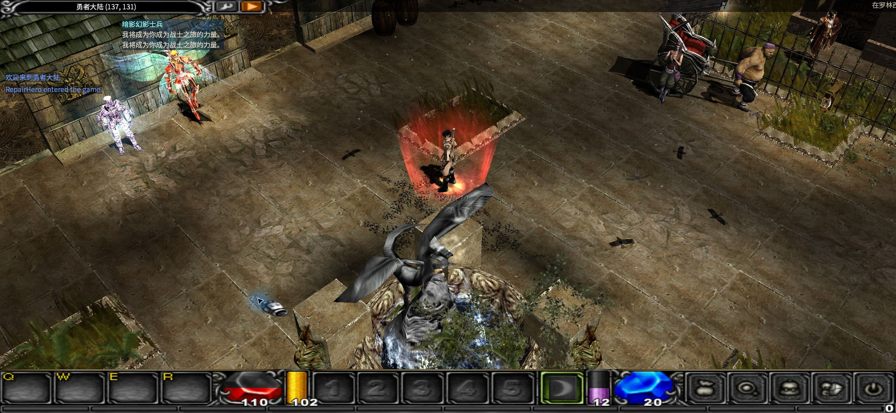
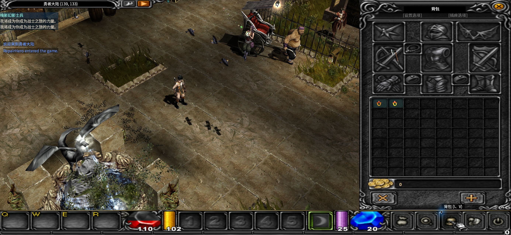
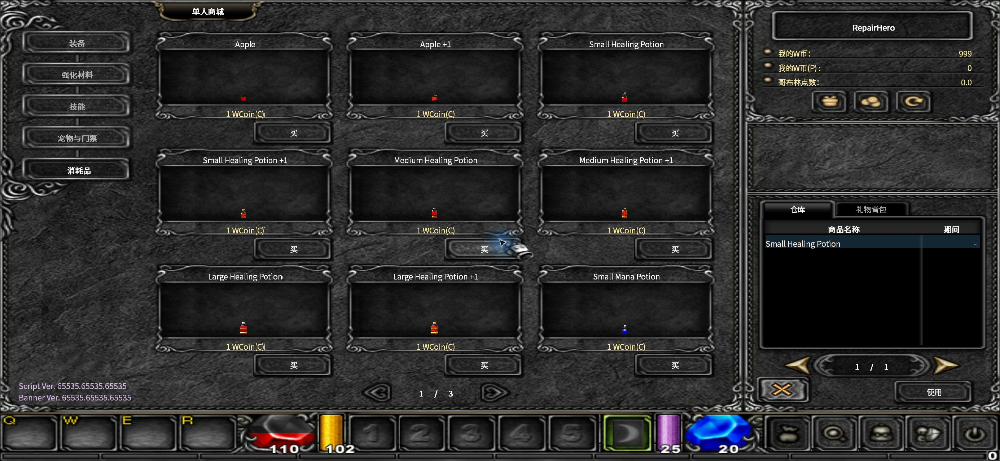

# OpenMU Transform

**A deep, ongoing rewrite of MU Online — one engine, every screen.**

Rebuilding a 2001-era MMO client and server into a modern, cross-platform,
controller-native codebase: Windows · macOS · Linux · Android · iOS · HarmonyOS.



[](#supported-platforms)
[](#gamepad-is-a-first-class-input-not-a-bolt-on)
[](#localization)
[](#architecture)
[](#architecture)
[-lightgrey?style=flat-square)](#credits--license)

---

## Why this project exists

The original MU Online client is a Windows-only, ANSI-encoded, fixed-function-OpenGL codebase
from 2001. It assumes a keyboard, a 4:3 monitor, and a single locale.

This project tears that apart and rebuilds it around modern assumptions: a renderer on
**OpenGL 3.3 Core Profile**, **Unicode-first** string handling, a **.NET Native AOT** client
library replacing the legacy network stack, a real **input abstraction layer** spanning
keyboard, mouse, touch and gamepad, and a shipping path to **six platforms**.

It is not a patch set. It is a rewrite that keeps the game playable at every step.

---

## Highlights

### Gamepad is a first-class input, not a bolt-on

The client has a genuine input abstraction layer — `GamepadService`, `SdlGamepadBackend`,
`GamepadMapper`, `GamepadBindings` and `FocusNavigator` — plus a purpose-built on-screen
keyboard for pad-only play.

- Full button remapping, with **restore-to-default**
- Analog stick **deadzone** and **pointer (cursor) speed** tuning
- **Y-axis inversion** for the cursor
- Five independent rumble channels — combat, UI, trading, plus overall enable and intensity
- **Short / long rumble test** buttons so you can feel the mapping before you commit
- Focus navigation that makes every menu reachable without a mouse


*Button mapping, deadzone, pointer speed, rumble intensity and a live current-mapping readout.*

### Supported platforms

| Platform | Status | Implementation |
| --- | --- | --- |
| **Windows x86 / x64** | Primary target | CMake + Ninja / MSBuild presets, MuEditor debug builds, AddressSanitizer and clang-tidy presets |
| **macOS** | Ported | Objective-C++ enabled at the CMake level, universal (arm64 + x86_64) client-library build |
| **Linux** | Build path | MinGW-w64 cross-compile toolchains; CLion / VS Code / Rider / console guides |
| **Android** | Shipping | ARM64 game and GM apps, Native AOT arm64 client library, Gradle pipeline |
| **iOS** | Ported | `game-ios` target plus `nativeaot-ios` client-library AOT props and build script |
| **HarmonyOS** | Ported | `harmony-game`, `harmony-gm` and `harmony-pc` modules, plus `nativeaot-ohos` |

### Touch that respects the game

The Android client is not a mouse emulator. It has a purpose-designed gesture layer:

- **Left-half drag** — move · **right-half tap** — select / confirm
- **Double-tap skill area** — cast the active skill
- **Two-finger horizontal swipe** — cycle skills · **pinch / vertical** — camera
- **Three-finger up** — map · **three-finger down** — settings
- **Long-press** to use an item or learn a skill, **hold-and-drag** to reposition without misfiring
- **Left-hand mode** that swaps the movement and skill zones *and* moves the side toolbar —
  without mirroring the in-game hit-test coordinates

Plus mobile-native quality-of-life: a frame-rate slider (30 FPS → device maximum), render-scale
control, effect levels, notch / rounded-corner safe areas, and adjustable on-screen button size
and opacity.


*Android client: gesture HUD, side toolbar, and inventory tooltips.*

### Localization

The UI is built for translation rather than retrofitted for it: a `.resx` → generated C++
accessor pipeline with runtime locale switching and observer hooks for cached strings.

**15 UI languages** across the launcher and account portal: English, Simplified Chinese,
Traditional Chinese, Japanese, Korean, German, Spanish, French, Portuguese, Russian, Ukrainian,
Polish, Indonesian, Vietnamese and Filipino.

### Balance designed on purpose

The numeric layer is a project in its own right (`OpenMU-数值重设计/`, *Numeric Redesign*) with
its own design documents, tuning log, integration harness and verification report — not a
scattering of magic numbers.

The phone balance profile is enforced **server-side**: level cap 400, master level cap 200,
5 stat points per level, distinct experience multipliers for the standard / relaxed / journey
profiles, and coordinated drop, Zen, potion-cooldown and +1…+15 upgrade rules.

### Performance work on the render path

- Core Profile GL: ring-buffer UBO streaming instead of per-update buffer orphaning
- Terrain draw calls collapsed via texture-pair bucketing — roughly **25× fewer draws**
- Redundant per-draw GL state changes removed
- GPU skeletal skinning
- Parallel character-animation tick pool for crowded scenes

Measured on development hardware: **average FPS +4.4%, 1% low +28.0%, frame time −4.1%.**

---

## Screenshots

| | |
| --- | --- |
|  |  |
| In-world gameplay | Inventory and equipment |
|  |  |
| NPC shop with server-side validation | Title / loading screen |

---

## Architecture

```
┌──────────────────────────────────────────────────────────────────┐
│  Clients                                                          │
│    MuMain            C++20 · SDL3 · OpenGL 3.3 Core Profile       │
│    Android / iOS / HarmonyOS shells                               │
├──────────────────────────────────────────────────────────────────┤
│  Shared input & UI layer                                          │
│    Input abstraction · GamepadService · FocusNavigator · touch    │
│    .resx-driven localization with runtime locale switching        │
├──────────────────────────────────────────────────────────────────┤
│  Network                                                          │
│    MUnique.OpenMU.Network — C# .NET 10 client library, Native AOT │
│    Season 6 Episode 3 protocol, extended for >16-bit values       │
├──────────────────────────────────────────────────────────────────┤
│  Server — OpenMU (C# / .NET 10)                                   │
│    Game logic · persistence · web admin panel · PostgreSQL        │
│    Local stack manager · package manifest validation              │
└──────────────────────────────────────────────────────────────────┘
```

**Unicode all the way down.** In memory the client works in UTF-16LE — every string and char
array is wide. Anything crossing a file or network boundary is UTF-8. The ANSI-only assumptions
are gone, and that is what makes the CJK and Cyrillic locales possible in the first place.

---

## Repository layout

| Path | Contents |
| --- | --- |
| `MuMain/` | C++ client engine — SDL3 / OpenGL, gamepad and input layer, localization pipeline |
| `OpenMU/` | C# / .NET 10 server, web admin panel, Windows launcher, tests |
| `OpenMU-Android/` | Android game app, GM app, Native AOT client library, Gradle build |
| `OpenMU-iOS/` | iOS game target and AOT client-library build |
| `OpenMU-HarmonyOS/` | HarmonyOS game, GM and PC modules |
| `OpenMU-数值重设计/` | Balance design documents, harness and verification (*Numeric Redesign*) |
| `loc/` | Localization data and tooling |
| `assets/` | Images used by this README |

---

## Building

Both halves build from source; full instructions live next to the code.

**Client** — requires CMake 3.25+, a C++20 toolchain, and the .NET 10 SDK for the client library.

```powershell
cmake --preset windows-x64
cmake --build --preset windows-x64-release
```

**Server** — requires the .NET 10 SDK.

```bash
dotnet build OpenMU/MUnique.OpenMU.sln
```

Platform-specific notes: [`MuMain/docs/build/`](MuMain/docs/build/) ·
[`OpenMU/QuickStart.md`](OpenMU/QuickStart.md) ·
[`OpenMU-Android/Build-AndroidPackage.ps1`](OpenMU-Android/Build-AndroidPackage.ps1)

### Maturity and packaging notes (read before you rely on a platform)

| Platform | Code | Packaging / distribution |
| --- | --- | --- |
| Windows | ready | full: `packtool.py`, release bundle, PowerShell provisioning scripts |
| Android | ready | full: Gradle + `Build-AndroidPackage.ps1` (arm64) |
| HarmonyOS | ready | full: hvigor modules, `OpenMU-HarmonyOS/build-tools` |
| macOS / Linux | builds and runs | **no release pipeline yet** — see below |
| iOS | honest scaffold | shell/main file only; no app bundle or data extraction yet |

* **Linux / macOS** compile and run, but there is no packaging script for them: the
  release tooling (`packtool.py`, `Build-AndroidPackage.ps1`) only targets Windows, and
  nothing provisions a PostgreSQL data directory with `bin/initdb` on Unix. Expect to lay
  out the PostgreSQL binaries yourself before the launcher can start the database.
* The operational scripts in the repository root (`provision_secrets.ps1`,
  `provision_account.ps1`, `deploy_server_update.py`, …) are PowerShell; run them with
  **pwsh 7+** if you are not on Windows. No bash equivalents exist yet.

---

## Credits & license

This is a **derivative work**. It would not exist without the people who kept these sources alive:

- **Webzen** — MU Online, the original game and its art
- **[sven-n/MuMain](https://github.com/sven-n/MuMain)** — the Season 5.2 client sources this
  engine is built on, and the origin of much of the Core Profile GL, translation-system and
  framerate work described above
- **[MUnique/OpenMU](https://github.com/MUnique/OpenMU)** — the server, licensed **MIT**
  (Copyright © 2017 MUnique)
- **Luois**, **Qubit**, and the RaGEZONE / tuservermu.com.ve communities for fixes and tooling
- **Nitoy** — the MU Helper

Third-party components retain their own licenses: SDL3 (zlib), SDL_mixer, Dear ImGui (MIT),
curl (MIT), librime (BSD-3-Clause), gl4es (MIT), libjpeg-turbo (IJG / BSD).

This repository is published for personal, educational and non-commercial purposes. MU Online
is a trademark of Webzen Inc. Screenshots show the client running against a locally hosted
server; the game art remains the property of its original owner.
